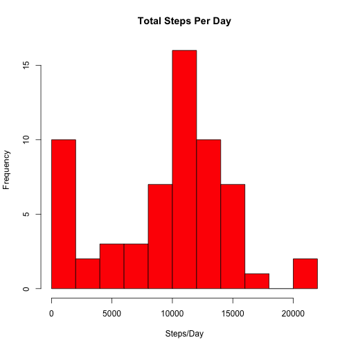
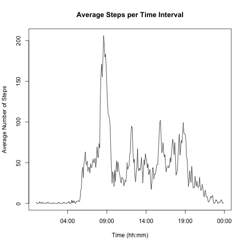
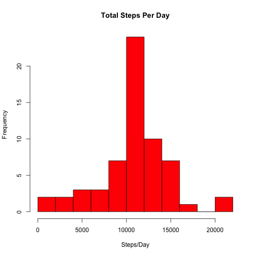
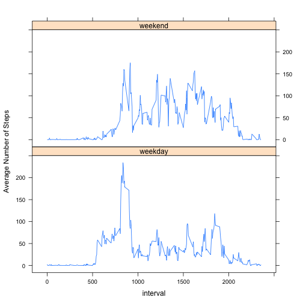

## Analysis of Activity Data


### Reading and Formating the Data
We'll start by reading in the data and transforming each column to a suitable format. This requires that the file "activity.csv" is in your working directory.

```r
activity <- read.csv("activity.csv")
activity <- transform(activity, date = as.Date(date))
sapply(activity, class)
```

```
##     steps      date  interval 
## "integer"    "Date" "integer"
```

We now have the data loaded into our work space and each column in a suitable format.
In order to make a histogram I need to sum the total amount of steps for each day in our dataset. I did this using the tapply function. 

### Histogram

```r
StepsDay <- tapply(activity$steps, activity$date, FUN = function(x) {
    sum(x, na.rm = T)
})
```

Here is a histogram of the total steps per day.

```r
hist(StepsDay, breaks = 10, xlab = "Steps/Day", main = "Total Steps Per Day", 
    col = "red")
```

 

```r
meanSteps <- mean(StepsDay)
medianSteps <- median(StepsDay)
```

The **mean** and **median** steps per day is 9354.2 and 10395, respectively.  

### Time Series Plot
If we want to look at the average number of steps per 5 minute period, we can use the aggregate function to calculate the mean of each interval. 


```r
StepsIntMean <- aggregate(activity$steps, list(activity$interval), FUN = function(x) {
    mean(x, na.rm = T)
})
names(StepsIntMean) <- c("interval", "AvgNumSteps")
```

We can now plot the average number of steps in each of the 5-minute intervals. In order to make the plot more legible, I will create a variable containing the time in a hh:mm (24-hour) format. *Note: this will also contain the date that it was created since it does not interfer with anything I am doing I did not clean that up*

```r
tmp1 <- formatC(StepsIntMean$interval, width = 4, format = "d", flag = "0")
tmp1 <- sub("([[:digit:]]{2,2})$", ":\\1", tmp1)
tmp1 <- as.POSIXlt(tmp1, format = c("%H:%M"))
plot(tmp1, StepsIntMean$AvgNumSteps, type = "l", xlab = "Time (hh:mm)", ylab = "Average Number of Steps", 
    main = "Average Steps per Time Interval")
```

 

To find the max average activity can use the which() function.

```r
a <- with(StepsIntMean, which(AvgNumSteps == max(AvgNumSteps)))
tmp1 <- strsplit(as.character(tmp1), split = " ")
MaxAct <- tmp1[[a]][2]
```

From this we find that the **maximum activity**, 206.2 steps, occurs during the 08:35:00 to 08:40:00 interval.  
  
### Dealing with NAs
Looking at the dataset "activity" we find that the steps column contains many missing vaues.

```r
summary(activity)
```

```
##      steps           date               interval   
##  Min.   :  0    Min.   :2012-10-01   Min.   :   0  
##  1st Qu.:  0    1st Qu.:2012-10-16   1st Qu.: 589  
##  Median :  0    Median :2012-10-31   Median :1178  
##  Mean   : 37    Mean   :2012-10-31   Mean   :1178  
##  3rd Qu.: 12    3rd Qu.:2012-11-15   3rd Qu.:1766  
##  Max.   :806    Max.   :2012-11-30   Max.   :2355  
##  NA's   :2304
```

In fact 2304 values out of the total 17568 are missing.  
I'm going to replace each NA with the average across all other days for the particular time interval containing the NA. First we'll create a dataframe containing the average number of steps for each of the missing intervals (we already have this in the StepsIntMean). Then we'll create a new dataframe "activityClean" where the NA's in the activity dataset have been replace with the average values for the cooresponding intervals. I used a for loop to do so.

```r
library(plyr)
a <- which(is.na(activity))
b <- as.data.frame(activity$interval[a])
names(b) = "interval"
NAlist <- join(b, StepsIntMean)
```

```
## Joining by: interval
```

```r
activityClean <- activity
for (i in 1:nrow(NAlist)) {
    activityClean[a[i], 1] <- as.integer(NAlist[i, 2])
}
```


Let's replot the above histogram with this new "clean" dataset.

```r
StepsDayClean <- tapply(activityClean$steps, activity$date, FUN = function(x) {
    sum(x, na.rm = T)
})
hist(StepsDayClean, breaks = 10, xlab = "Steps/Day", main = "Total Steps Per Day", 
    col = "red")
```

 

```r
meanStepsClean <- mean(StepsDayClean)
medianStepsClean <- median(StepsDayClean)
```

Comparing the mean and median (10749.8 and 10641, respectivly) of this clean data to the original data set (mean: 9354.2, median:10395) we can see that both the mean and the median has increased and that the mean is now larger than the median. From the histogram it's also evident that most of the counts in the 0-2000 bin are gone. This is since some days contained only NA's and the sum of only NA's is 0 (given that the argument na.rm=TRUE). These days now show up in the middle bar hence the increased frequency there.  

###Activity on Weekends vs Weekdays

I will now add a variable called WeekOrEnd that indicates whether or not a certain observation were made during a weekday or weekend. 

```r
activity$WeekOrEnd <- weekdays(activity$date)
activity$WeekOrEnd <- gsub(c("Monday|Tuesday|Wednesday|Thursday|Friday"), "weekday", 
    activity$WeekOrEnd)
activity$WeekOrEnd <- gsub("Saturday|Sunday", "weekend", activity$WeekOrEnd)
activity <- transform(activity, WeekOrEnd <- as.factor(WeekOrEnd))
head(activity)
```

```
##   steps       date interval WeekOrEnd
## 1    NA 2012-10-01        0   weekday
## 2    NA 2012-10-01        5   weekday
## 3    NA 2012-10-01       10   weekday
## 4    NA 2012-10-01       15   weekday
## 5    NA 2012-10-01       20   weekday
## 6    NA 2012-10-01       25   weekday
```


In order to create a time series plot for weekdays and weekends we need to calculate the mean for each interval for both groups.


```r
StepsIntMean2 <- aggregate(activity$steps, list(activity$interval, activity$WeekOrEnd), 
    FUN = function(x) {
        mean(x, na.rm = T)
    })
names(StepsIntMean2) <- c("interval", "WeekOrEnd", "AvgNumSteps")
```

I then use the lattice package to create the plots.

```r
library(lattice)
with(StepsIntMean2, xyplot(AvgNumSteps ~ interval | WeekOrEnd, type = "l", layout = c(1, 
    2), ylab = ("Average Number of Steps")))
```

 

